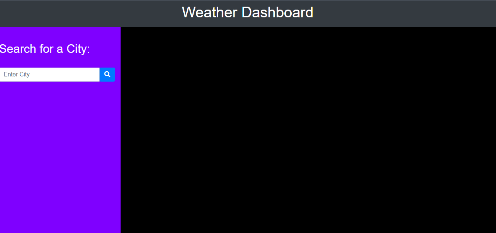
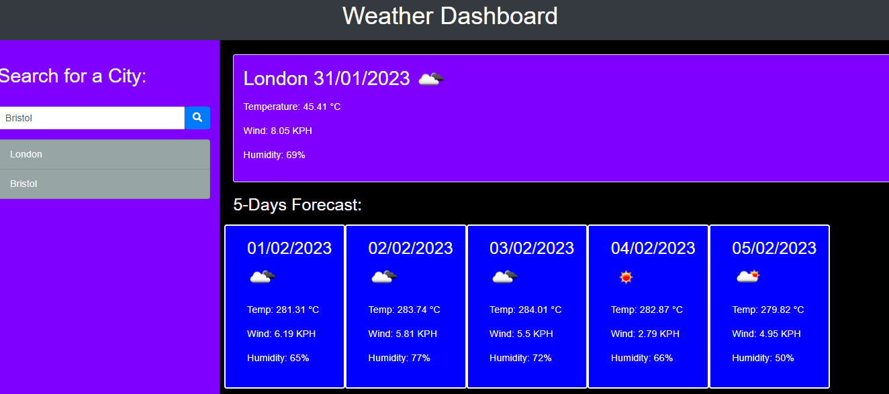

# Weather-Dashboard

## 📌 Description
The Weather Dashboard is a web application that provides real-time weather information for multiple cities. Users can search for a city and view its current weather conditions along with a 5-day forecast. This helps travelers plan their trips accordingly. The application uses the OpenWeather API to fetch weather data and stores search history in localStorage for quick access to previous searches.

## 🛠 Prerequisites
* An API key from OpenWeather.
* A web browser to access the application.

## 📋 Criteria
* Search for a city to view its current weather conditions.
* Display a 5-day weather forecast with key weather details.
* Save search history, allowing users to revisit previous searches.
* Responsive design, optimized for both mobile and desktop users.

When a user searches for a city:
* They see current and future weather conditions for that city.
* The city is saved to search history for easy access.

The current weather display includes:
* City name
* Date
* Weather icon representing conditions
* Temperature
* Humidity
* Wind speed

The 5-day forecast includes:
* Date
* Weather icon
* Temperature
* Humidity
* Wind speed

Additional functionality:
* Clicking a city from the search history reloads its current and future weather conditions.

## 💻 Technologies Used
This project is built using:
* HTML
* CSS
* JavaScript
* jQuery
* Moment.js
* Bootstrap
* Server-Side API - OpenWeather API
* Local Storage

## 🚀 Installation
No installation required—simply open the application in a web browser.

## 📚 Usage
1. Open the Weather Dashboard in your web browser.
2. Enter a city name in the search field.
3. Click the Search button to retrieve weather data.
4. View current weather conditions and a 5-day forecast.
5. Click a city from search history to reload its weather details.

## 🔗 Live Demo & Repository
Application can be viewed here:
* [Live](https://yvonnesarah.github.io/Weather-Dashboard/)

* [Repository](https://github.com/yvonnesarah/Weather-Dashboard)

## 🖼 Screenshot(S)
Weather Dashboard

Example City searched

## 👥 Credit
N/A

## 📜 License
This project is open-source. For licensing details, please refer to the LICENSE file in the repository.

## 📬 Contact
You can reach me at 📧 yvonneadedeji.sarah@gmail.com.
